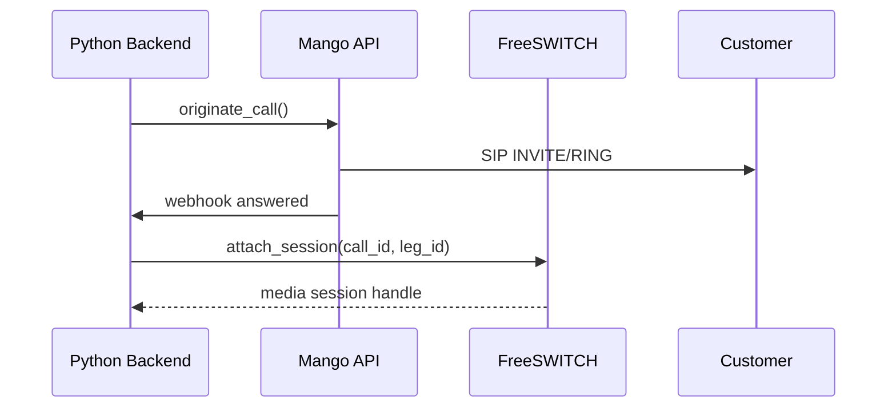
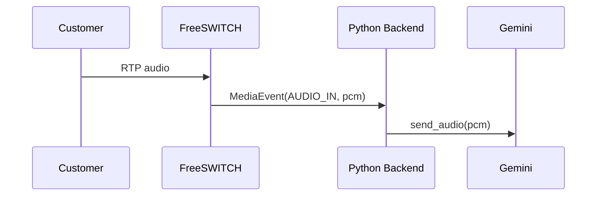
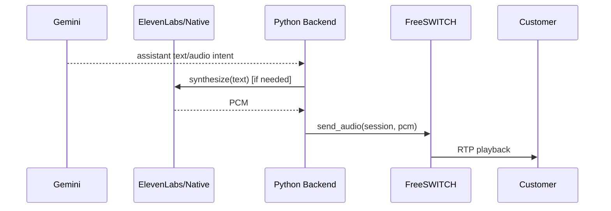
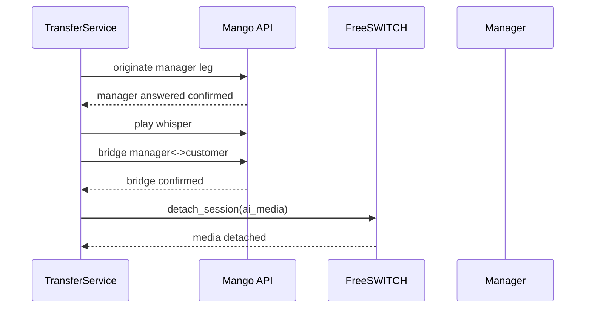

# Mango Media Gateway Architecture

## 1. Target Architecture
Recommended gateway: **FreeSWITCH**.

Reason for FreeSWITCH over Asterisk in this project:
- Strong RTP/media switching focus (mod_conference, bypass/proxy media patterns).
- Stable ESL control surface for external orchestration.
- Good fit for separating control plane (Python) and media plane (RTP gateway).

High-level path:

`Mango SIP Trunk <-> FreeSWITCH <-> Python Backend <-> Gemini / ElevenLabs`

Control plane stays in backend (`MangoTelephonyAdapter`, transfer orchestration).  
Media plane is delegated to gateway contracts (`AbstractMediaGateway` + `FreeSwitchAudioBridge`).

## 2. Control Plane vs Media Plane
- Control plane:
  - originate / terminate / bridge / whisper confirmations
  - webhook normalization, leg states, transfer state machine
- Media plane:
  - RTP ingress from customer
  - PCM egress from AI TTS
  - interruption (barge-in) signaling
  - hangup propagation

No business logic is placed in media gateway module.

## 3. Mango <-> FreeSWITCH Interconnect
- Trunk:
  - Mango SIP trunk points to FreeSWITCH SIP profile (`external` by default).
- Leg ownership:
  - Mango owns telephony provider identities and call control API.
  - FreeSWITCH owns media session and RTP relay for active leg.
- RTP flow:
  - Customer RTP arrives to FreeSWITCH.
  - Gateway forwards normalized audio events to backend.
  - Backend returns PCM (Gemini/ElevenLabs output) to gateway.
  - FreeSWITCH injects audio back to call leg.
- Bridge semantics:
  - Warm transfer bridge remains validated in control plane.
  - Media plane should detach AI session when manager bridge is confirmed.

## 4. Sequence Diagrams

### 4.1 Outbound AI Call

### 4.2 Inbound Customer Speech

### 4.3 AI Response Back to Customer

### 4.4 Transfer to Manager

## 5. Current Implementation Status
- Implemented now:
  - media gateway contracts (`AbstractMediaGateway`)
  - FreeSWITCH integration layer scaffold (`FreeSwitchMediaGateway`)
  - ESL client loop (connect/auth/subscribe/command)
  - RTP UDP ingest/inject baseline (`esl_rtp` mode)
  - bridge adapter (`FreeSwitchAudioBridge`)
  - configuration/env for gateway
  - architecture-level mock-mode tests
- Not implemented yet:
  - SDP negotiation (current mode expects RTP endpoint command template wiring)
  - codec/transcoding pipeline
  - production NAT/firewall hardening

## 6. Readiness Classification
- `PRODUCTION_READY`: none in media gateway RTP path.
- `INTEGRATION_READY`: contract layer + attach/detach + mock-mode bridge integration.
- `NEEDS_REAL_WORLD_VALIDATION`: real FreeSWITCH trunk/RTP interop with Mango.
- `MOCK_ONLY`: `media_gateway_mode=mock`.

## 7. “Real Audio Works” Criteria
Only consider real audio working when all are proven in live integration:
1. Customer speech reaches backend continuously (RTP->PCM).
2. AI PCM is audible to customer with acceptable latency.
3. Barge-in interrupts AI playback correctly.
4. Hangup propagates across Mango, FreeSWITCH, backend without orphan sessions.
5. Warm transfer bridge detaches AI media path cleanly.

## 8. What Remains For True Real-Time Audio (Honest)
Blockers:
1. No real-world validation for `Mango trunk <-> FreeSWITCH <-> backend`.
2. Command template + channel UUID assumptions are deployment-specific and must be tuned on live tenant.
3. No confirmed latency/jitter/SRTP/NAT characteristics in production-like environment.
4. No codec/transcoding hardening for mixed payload types.

Summary:
Control-plane has improved significantly, and media-plane now includes baseline `esl_rtp` runtime.
It is not a production audio path yet.
